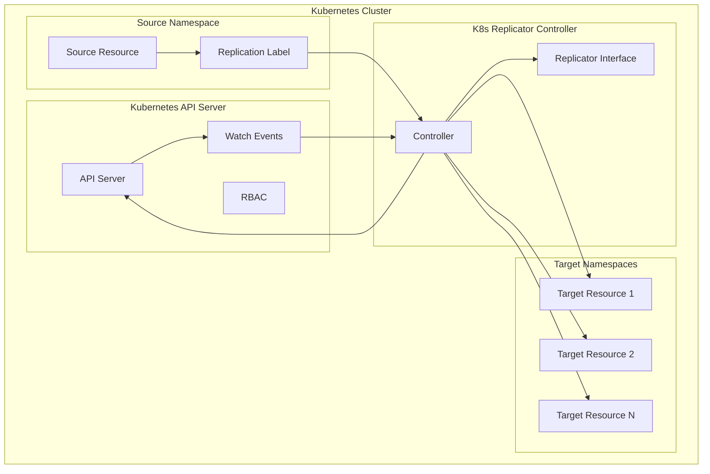

# Architecture Overview 🏗️

Welcome to the architecture guide! 🏗️ K8s Replicator is a Kubernetes operator designed with extensibility, performance, and reliability in mind. This document explains the technical architecture and design decisions.

## High-Level Architecture 🎯



## Core Components 🔧

### Replication Controller

- Watches for resources with replication labels
- Coordinates replication across namespaces
- Handles updates, deletions, and conflicts

### Namespace Controller

- Discovers target namespaces
- Applies filtering rules (ignores `kube-*`, respects labels)
- Manages namespace lifecycle events

### Replicator Interface

Extensible interface for different resource types:

```go
type Replicator interface {
    GetKind() string
    AddToScheme(scheme *runtime.Scheme) error
    EmptyObject() client.Object
    EmptyObjectList() client.ObjectList
    ObjectListToArray(client.ObjectList) []client.Object
    Replicate(sourceObject client.Object, targetObject client.Object)
}
```

**Supported Resources:** See [API Documentation](API.md#supported-resources) for currently supported resource types.

## Data Flow 🔄

1. **Resource Discovery**: Watch for resources with replication labels
2. **Namespace Discovery**: Find target namespaces (filtered)
3. **Replication**: Create/update resources in target namespaces

## Extensibility Design 🔌

Plugin-based architecture for easy addition of new resource types:

```go
// Example: Adding any Kubernetes resource type
type YourResourceReplicator struct {
    // Implementation of Replicator interface
}

func (r *YourResourceReplicator) GetKind() string {
    return "YourResourceKind"  // Any Kubernetes resource
}

func (r *YourResourceReplicator) Replicate(source, target client.Object) {
    // Custom replication logic for your resource
}

// Register new replicator in NewReplicators() function
func NewReplicators() []Replicator {
    return []Replicator{
        newSecretReplicator(),
        newConfigMapReplicator(),
        newNetworkPolicyReplicator(),
        &YourResourceReplicator{}, // Add your replicator here
    }
}
```

**Benefits:**

- **Modularity**: Independent resource types
- **Testability**: Isolated component testing
- **Maintainability**: Changes don't affect other types
- **Extensibility**: Add new types without core changes

## Performance Considerations ⚡

**Scalability:**

- Multiple resource types simultaneously
- Efficient event processing
- Optimized API server interactions

**Optimizations:**

- Batch operations to reduce API calls
- Cache namespace lists and metadata
- Event filtering for relevant events only
- Resource pooling to reduce GC

## Security Architecture 🔐

**RBAC Integration:**

- Required permissions for secrets, configmaps, networkpolicies, namespaces
- Proper access control for all operations

**Security Features:**

- Label-based filtering
- Replication actions logging

**Considerations:**

- Secret management with encryption
- Network policy security boundaries
- Resource quota respect
- Access control compliance

## Deployment Architecture 🚀

**Deployment Options:**

- **OLM Bundle**: Recommended for production
- **Direct Deployment**: For development and testing

**High Availability:**

- Leader election prevents multiple instances
- Health checks (liveness/readiness probes)
- Graceful shutdown with proper cleanup
- Automatic cleanup of orphaned resources

## Monitoring & Configuration 📊

**Logging:**

- Structured logging with resource, namespace, duration, success status
- OpenTelemetry integration for distributed tracing
- Request correlation across components

**Configuration:**

- Controller-runtime configuration via command-line flags
- Automatic namespace detection from Kubernetes environment

---

This architecture provides a solid foundation while maintaining flexibility for future enhancements. 🚀

We hope this helps you understand how K8s Replicator works! 🤓✨
