# Architecture Overview 🏗️

Welcome to the architecture guide! 🏗️ K8s Replicator is a Kubernetes operator designed with extensibility, performance, and reliability in mind. This document explains the technical architecture and design decisions.

## High-Level Architecture 🎯

```mermaid
graph TB
    subgraph K8S["🚀 Kubernetes Cluster"]
        subgraph SRC["📦 Source Resources"]
            S1[Source Resource 1<br/>Secret with replication label]
            S2[Source Resource 2<br/>ConfigMap with replication label]
            S3[Source Resource N<br/>NetworkPolicy with replication label]
        end

        subgraph NS["🌐 All Namespaces"]
            NS1[Namespace 1<br/>app-team-a]
            NS2[Namespace 2<br/>app-team-b]
            NS3[Namespace N<br/>ignored namespace]
        end

        subgraph CTRL["⚙️ K8s Replicator Controllers (Independent)"]
            RC[🔄 Replication Controller<br/>Watches Source Resources<br/>Performs Replication]
            NC[🌐 Namespace Controller<br/>Watches Namespaces<br/>Maintains Target Cache]
            RI[🔌 Replicator Interface<br/>Data Transformation]
        end

        subgraph TGT["🎯 Target Namespaces"]
            T1[📋 Replica in NS1<br/>app-team-a]
            T2[📋 Replica in NS2<br/>app-team-b]
        end

        subgraph API_SRV["☸️ Kubernetes API Server"]
            WATCH_R[👁️ Resource Watch Events]
            WATCH_N[👁️ Namespace Watch Events]
        end
    end

    %% Replication Controller Flow
    WATCH_R --> RC
    S1 -.-> WATCH_R
    S2 -.-> WATCH_R
    S3 -.-> WATCH_R
    RC --> RI
    RC --> T1
    RC --> T2

    %% Namespace Controller Flow
    WATCH_N --> NC
    NS1 -.-> WATCH_N
    NS2 -.-> WATCH_N
    NS3 -.-> WATCH_N
    NC --> RI
    NC --> T1
    NC --> T2

    %% Styling with better contrast
    style S1 fill:#bbdefb,stroke:#1976d2,stroke-width:2px,color:#000
    style S2 fill:#bbdefb,stroke:#1976d2,stroke-width:2px,color:#000
    style S3 fill:#bbdefb,stroke:#1976d2,stroke-width:2px,color:#000
    style NS1 fill:#dcedc8,stroke:#689f38,stroke-width:2px,color:#000
    style NS2 fill:#dcedc8,stroke:#689f38,stroke-width:2px,color:#000
    style NS3 fill:#ffcdd2,stroke:#d32f2f,stroke-width:2px,color:#000
    style RC fill:#e1bee7,stroke:#7b1fa2,stroke-width:2px,color:#000
    style NC fill:#c8e6c9,stroke:#388e3c,stroke-width:2px,color:#000
    style RI fill:#f8bbd9,stroke:#c2185b,stroke-width:2px,color:#000
    style T1 fill:#b2dfdb,stroke:#00695c,stroke-width:2px,color:#000
    style T2 fill:#b2dfdb,stroke:#00695c,stroke-width:2px,color:#000
    style WATCH_R fill:#b3e5fc,stroke:#0277bd,stroke-width:2px,color:#000
    style WATCH_N fill:#c8e6c9,stroke:#388e3c,stroke-width:2px,color:#000
```



## Core Components 🔧

### Replication Controller

- Watches for resources with replication labels independently
- Coordinates replication across namespaces using cached namespace data
- Handles resource updates, deletions, and conflicts
- Uses namespace cache maintained by the Namespace Controller

### Namespace Controller

- Independently watches for namespace lifecycle events
- Maintains internal cache of filtered target namespaces
- Applies filtering rules (ignores `kube-*`, respects labels)
- **Replicates existing sources to new namespaces**: When a new valid namespace is discovered, replicates all existing source resources to the new namespace
- Operates in parallel with the Replication Controller

### Replicator Interface

Extensible interface for different resource types. The complete interface definition and documentation can be found in [`controllers/replication/replicator.go`](controllers/replication/replicator.go).

**Key Interface Methods:**

- `GetKind()` - Returns the Kubernetes resource kind
- `AddToScheme()` - Registers the resource type with the scheme
- `EmptyObject()` - Creates empty resource instances for API operations
- `Replicate()` - Copies data between objects (no API calls, pure data transformation)

**Supported Resources:** See [API Documentation](API.md#supported-resources) for currently supported resource types.

## Data Flow 🔄

```mermaid
sequenceDiagram
    participant User
    participant K8sAPI as Kubernetes API
    participant RC as Replication Controller
    participant NC as Namespace Controller
    participant Cache as Namespace Cache
    participant RI as Replicator Interface

    Note over RC, NC: Controllers operate independently - no direct communication

    %% Namespace Controller - Independent Discovery & Replication
    Note over NC: 🌐 Namespace Controller - Independent Operations
    K8sAPI->>NC: Watch Event (Namespace Create/Update/Delete)
    NC->>NC: Apply filtering rules (ignore kube-*, check labels)
    NC->>Cache: Update filtered namespace list

    Note over NC: New namespace discovered - replicate existing sources

    loop For each Source Resource
        NC->>RI: Get EmptyObject() for target type
        RI->>NC: Return Empty Target Object
        NC->>RI: Call Replicate(source, target)
        Note over RI: Pure data copying between Go objects<br/>No API calls - memory operations only
        RI->>NC: Data Copying Complete
        Note over NC: Direct replication to new namespace
        NC->>Target: Create Replica Resource in New Namespace
    end

    %% Replication Controller - Independent Discovery & Replication
    Note over RC: 🔄 Replication Controller - Independent Operations
    User->>K8sAPI: Create/Update Resource with replication label
    K8sAPI->>RC: Watch Event (Source Resource Create/Update/Delete)

    loop For each Target Namespace
        RC->>RI: Get EmptyObject() for target type
        RI->>RC: Return Empty Target Object
        RC->>RI: Call Replicate(source, target)
        Note over RI: Pure data copying between Go objects<br/>No API calls - memory operations only
        RI->>RC: Data Copying Complete
        Note over RC: Direct replication to target namespace
        RC->>Target: Create Replica Resource in Target Namespace
    end

    %% Show parallel nature
    Note over RC, NC: Both controllers run continuously in parallel<br/>Namespace changes automatically available to Replication Controller
```



**Key Steps:**

**Namespace Controller (Independent):**

1. **Namespace Monitoring**: Continuously watches for namespace create/update/delete events
2. **Cache Management**: Maintains an internal filtered cache of target namespaces
3. **New Namespace Replication**: When a new valid namespace is discovered, replicates all existing source resources to the new namespace

**Replication Controller (Independent):**

1. **Resource Discovery**: Watches for resources with replication labels
2. **Object Preparation**: Creates empty target object using Replicator interface
3. **Data Replication**: Uses Replicator interface to copy data between Go objects (pure memory operations)
4. **Direct Replication**: Directly creates replica resources in target namespaces

## Extensibility Design 🔌

Plugin-based architecture for easy addition of new resource types:

```go
// Example: Adding any Kubernetes resource type
type YourResourceReplicator struct {
    // Implementation of Replicator interface
}

func (r *YourResourceReplicator) GetKind() string {
    return "YourResourceKind"  // Any Kubernetes resource
}

func (r *YourResourceReplicator) Replicate(source, target client.Object) {
    // Custom replication logic for your resource
}

// Register new replicator in NewReplicators() function
func NewReplicators() []Replicator {
    return []Replicator{
        newSecretReplicator(),
        newConfigMapReplicator(),
        newNetworkPolicyReplicator(),
        &YourResourceReplicator{}, // Add your replicator here
    }
}
```

**Benefits:**

- **Modularity**: Independent resource types
- **Testability**: Isolated component testing
- **Maintainability**: Changes don't affect other types
- **Extensibility**: Add new types without core changes

## Performance Considerations ⚡

**Scalability:**

- Multiple resource types simultaneously
- Efficient event processing
- Optimized API server interactions

**Optimizations:**

- Batch operations to reduce API calls
- Cache namespace lists and metadata
- Event filtering for relevant events only
- Resource pooling to reduce GC

## Security Architecture 🔐

**RBAC Integration:**

- Required permissions for secrets, configmaps, networkpolicies, namespaces
- Proper access control for all operations

**Security Features:**

- Label-based filtering
- Replication actions logging

**Considerations:**

- Secret management with encryption
- Network policy security boundaries
- Resource quota respect
- Access control compliance

## Deployment Architecture 🚀

**Deployment Options:**

- **OLM Bundle**: Recommended for production
- **Direct Deployment**: For development and testing

**High Availability:**

- Leader election prevents multiple instances
- Health checks (liveness/readiness probes)
- Graceful shutdown with proper cleanup
- Automatic cleanup of orphaned resources

## Monitoring & Configuration 📊

**Logging:**

- Structured logging with resource, namespace, duration, success status
- OpenTelemetry integration for distributed tracing
- Request correlation across components

**Configuration:**

- Controller-runtime configuration via command-line flags
- Automatic namespace detection from Kubernetes environment

---

This architecture provides a solid foundation while maintaining flexibility for future enhancements. 🚀

We hope this helps you understand how K8s Replicator works! 🤓✨
