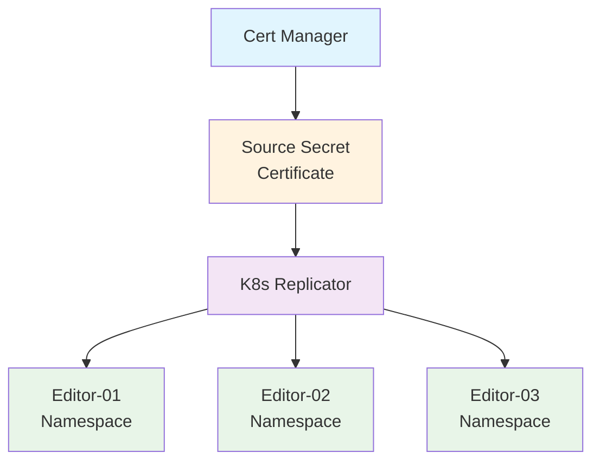

# Cert Manager Example 🔐

Welcome to the Cert Manager example! 🔐 This demonstrates how to use K8s Replicator with [Cert Manager](https://cert-manager.io/) to share TLS certificates across multiple microservices.

## Problem & Solution 🎯

**Problem:** Kubernetes security model doesn't allow pointing to TLS secrets across namespaces, so certificates need to be copied manually.

**Solution:** K8s Replicator automates copying and rotation of certificates, automatically propagating updates to all replicated namespaces.

## Example Scenario 📋

**Setup:** Three Visual Studio Code editors with shared wildcard TLS secret (`*.vscode.local`):

- editor-01.vscode.local
- editor-02.vscode.local  
- editor-03.vscode.local

**Certificate Management:** Cert Manager issues certificate from a common self-signed certificate. You can modify the certificate issuance method and use K8s Replicator with any technique.

## Quick Start ⚡

**Prerequisites:**

See the main [Installation Guide](../../README.md#quick-start-) for K8s Replicator setup requirements.

**Running This Example:**
```bash
# Setup the example
bash setup.sh

# Validate the deployment
bash validate.sh

# Clean up resources
bash clean.sh
```

## What This Example Demonstrates 🔧

**Certificate Management Features:**
- **TLS Certificate Distribution** - Automatic replication across namespaces
- **Wildcard Certificate Usage** - Single certificate for multiple subdomains
- **Certificate Rotation** - Automatic updates when certificates are renewed
- **Microservices Integration** - Seamless certificate sharing across services

**K8s Replicator Features:**
- **Automatic Replication** - Certificates replicated to target namespaces
- **Label-based Control** - Fine-grained control over replication
- **Namespace Filtering** - Control which namespaces receive certificates
- **Update Propagation** - Changes automatically propagated to replicas

## Architecture 🏗️



## Files Included 📁

- **`setup.sh`** - Installs Cert Manager and sets up the example
- **`validate.sh`** - Validates that certificates are properly replicated
- **`clean.sh`** - Removes all example resources
- **`cert-issuer/`** - Certificate issuer configuration
- **`editors/`** - VS Code editor deployments with TLS

## Troubleshooting 🔧

**Certificate Not Issued:**
```bash
# Check cert-manager status
kubectl get pods -n kr-cert-manager

# Check certificate status
kubectl get certificate -n kr-cert-manager
kubectl describe certificate vscode-cert -n kr-cert-manager
```

**Certificate Not Replicated:**

For general replication troubleshooting, see the [Troubleshooting Guide](../../TROUBLESHOOTING.md#replication-problems-). 

Cert-manager specific checks:
```bash
# Check if secret has replication label
kubectl get secret vscode-cert -n kr-cert-manager -o yaml | grep replicator.nadundesilva.github.io
```

**Ingress TLS Issues:**
```bash
# Check ingress configuration
kubectl get ingress -A

# Verify certificate in target namespaces
kubectl get secrets -A | grep vscode-cert
```

## Customization 🎨

**Use Different Certificate Issuer:**
1. Modify `cert-issuer/` configuration files
2. Update certificate issuer type (Let's Encrypt, private CA, etc.)
3. Adjust certificate configuration as needed

**Add More Services:**
1. Create new namespace directory under `editors/`
2. Copy and modify existing service configuration
3. Update ingress hostname and paths

**Different Certificate Types:**
- Replace wildcard certificate with individual certificates
- Use different certificate authorities
- Implement certificate rotation policies

## Best Practices 💡

For general best practices, see the [Examples Best Practices](../README.md#best-practices-).

**Certificate-Specific Best Practices:**
- **Certificate Rotation**: Monitor and automate certificate renewal
- **Certificate Backup**: Backup certificate configurations and keys
- **Certificate Dependencies**: Document which services depend on which certificates
- **Certificate Monitoring**: Set up alerts for certificate expiration
- **Certificate Validation**: Verify certificate replication across all target namespaces

---

**Happy certificate management!** 🔐✨

For more information, see the main [Examples Documentation](../README.md) or [K8s Replicator Documentation](../../README.md).
